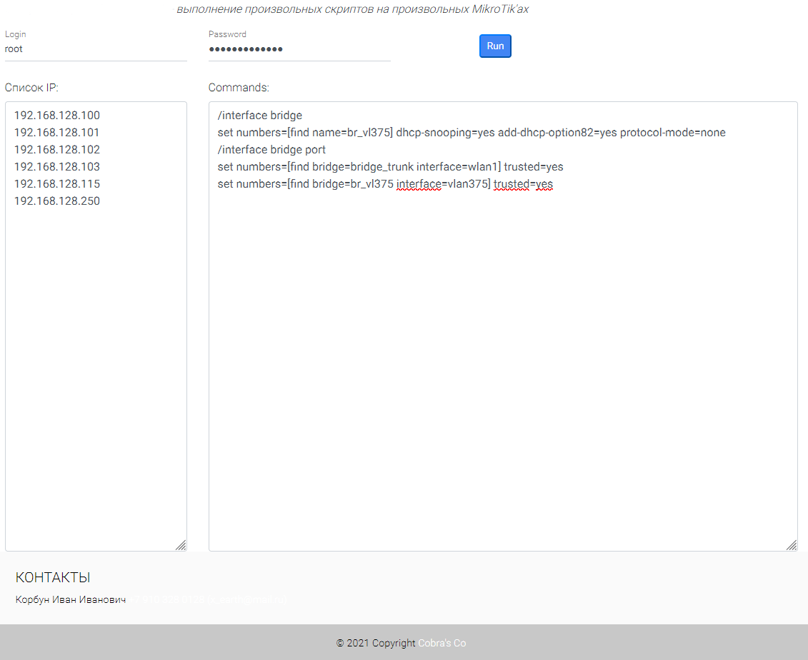
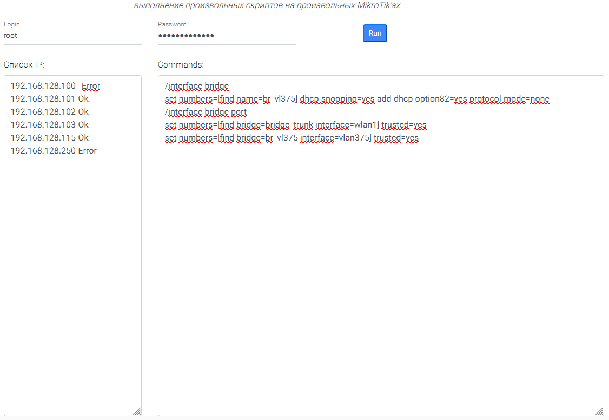

# djangoRusSripts
# Run scripts on ROS Mikrotik API with [python3-rosapi](https://github.com/Cobra5778/python3-rosapi)

According to the list of IP addresses, the specified script is executed on mikrotik equipment.

